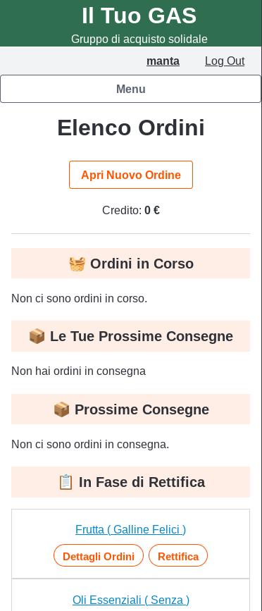

# Ordini, presidi e notifiche

## Cosa permette di fare

Gestire il ciclo di un ordine collettivo su un produttore: apertura con
una scadenza per ordinare e una data di consegna, raccolta degli ordini
dei singoli soci dal listino, chiusura con calcolo automatico di quanto
deve ciascuno (scalato dal credito, vedi
[`portafoglio.md`](portafoglio.md)). Non esiste un concetto di "ordine
che si ripete da solo": ogni ciclo si apre esplicitamente, ma un
produttore può avere ordini aperti a cadenza regolare (es. ogni mese) —
è qui che entrano in gioco le notifiche di scadenza, per non doverli
controllare a mano.

Include anche i **turni di presidio**: la prenotazione di chi si occupa
del ritiro/consegna della merce nel giorno stabilito, per i GAS che
organizzano il ritiro con un presidio fisico a turni.

 

## Chi la può usare

- Qualunque socio loggato può ordinare da un ordine aperto, prenotare un
  turno di presidio, e iscriversi alle notifiche.
- Aprire, modificare, chiudere un ordine, o rettificarlo dopo la
  consegna (es. quando il costo reale differisce da quanto ordinato) è
  riservato al referente del produttore o al moderatore.

## Prerequisiti

Un produttore con un listino compilato (vedi
[`produttori-e-listini.md`](produttori-e-listini.md)).

## Come si usa

1. Il referente apre un ordine sul produttore, con scadenza (ultimo
   giorno utile per ordinare) e data di consegna.
2. Ogni socio, entro la scadenza, seleziona dal listino i prodotti e le
   quantità che vuole.
3. Alla scadenza il referente chiude l'ordine: il sito calcola il totale
   per ciascun socio e lo scala dal credito. L'ordine passa tra quelli
   "chiusi", consultabile nell'archivio.
4. Se il costo reale consegnato differisce da quanto ordinato (rotture di
   stock, arrotondamenti sul peso, ecc.), il referente fa una rettifica:
   il credito del socio viene corretto di conseguenza.
5. **Notifiche**: un socio può iscriversi per essere avvisato quando un
   produttore apre un nuovo ordine, o per ricevere un promemoria via
   email 24 ore prima della scadenza di un ordine a cui non ha ancora
   partecipato — utile per non perdere la finestra di un produttore che
   ordina raramente.
6. **Turni di presidio**: nei giorni di consegna configurati, i soci
   possono prenotarsi per il turno di ritiro/allestimento; un vademecum
   dedicato spiega gli orari e le indicazioni pratiche della sede.
