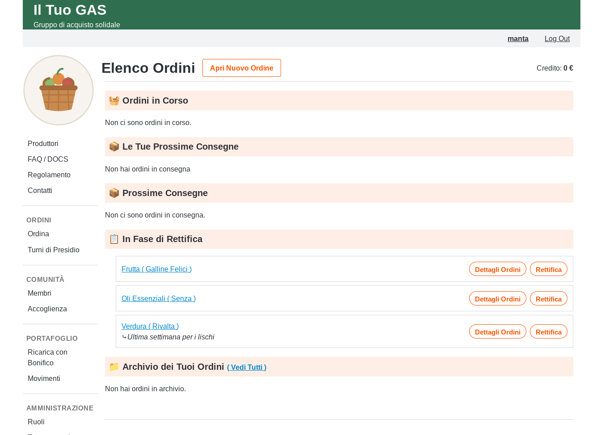

# DDGAS — cosa fa e cosa serve per adottarlo

Questa pagina è per chi sta valutando se usare DDGAS per il proprio Gruppo
di Acquisto Solidale (GAS): cosa permette di fare, cosa serve avere prima
di iniziare, e dove trovare il dettaglio di ogni funzionalità. Per un
caso d'uso reale vedi [`casi-duso.md`](casi-duso.md); per la checklist
tecnica di attivazione di una nuova istanza vedi
[`ONBOARDING.md`](../ONBOARDING.md).

## Cosa fa

DDGAS è un gestionale web per GAS: sostituisce fogli di calcolo, gruppi
WhatsApp e contabilità a mano con un unico sito dove i soci ordinano dai
produttori, il gruppo gestisce gli ordini collettivi e il ritiro della
merce, e ognuno tiene un credito prepagato invece di pagare in contanti
al ritiro.

In pratica: un referente apre un ordine su un produttore con una
scadenza, i soci ordinano dal listino entro quella data, alla chiusura il
sito calcola quanto deve ciascuno e lo scala automaticamente dal suo
credito. Nessun contante che gira, nessun foglio da tenere aggiornato a
mano.

## Cosa serve per partire

- **Un conto corrente dedicato al gruppo**, con IBAN da comunicare ai
  soci: è dove arrivano le ricariche di credito (bonifico, sempre
  disponibile) e da cui il gruppo paga i produttori.
- **Almeno una persona disposta a fare da moderatore/tesoriere**: crea i
  produttori e i listini, apre e chiude gli ordini, gestisce ruoli e
  riconciliazione dei pagamenti. Il carico si può dividere su più ruoli
  (vedi [`comunita.md`](comunita.md)), ma qualcuno deve occuparsene.
- **Un posto dove ospitare il sito** (hosting): DDGAS è un'applicazione
  Flask + Postgres, autoconsistente — puoi ospitarla dove preferisci.
- **Opzionale — un account Stripe e/o Satispay**, solo se oltre al
  bonifico vuoi offrire ricariche di credito con carta o app: senza,
  resta comunque disponibile la ricarica via bonifico.

Nessun altro vincolo: non serve essere un'associazione con personalità
giuridica, né avere un numero minimo di soci.

## Le funzionalità, in breve

| Area | Cosa copre | Dettaglio |
|---|---|---|
| Produttori e listini | Anagrafica dei fornitori, prodotti configurabili (prezzo, quantità min/max, disponibilità), import/export da CSV | [`produttori-e-listini.md`](produttori-e-listini.md) |
| Ordini | Apertura/chiusura ordini collettivi, turni di presidio per il ritiro, notifiche di scadenza, archivio storico | [`ordini.md`](ordini.md) |
| Portafoglio | Credito prepagato, ricariche (carta, Satispay, bonifico), giroconto tra soci, cassa e movimenti | [`portafoglio.md`](portafoglio.md) |
| Comunità | Elenco membri, ruoli utente, tesseramento annuale | [`comunita.md`](comunita.md) |
| Stampe ed esportazioni | Riepiloghi ordine, export soci/tesserati in CSV | [`stampe-ed-esportazioni.md`](stampe-ed-esportazioni.md) |

Ogni file copre una sola area e viene aggiornato insieme al codice che
descrive: se una funzionalità cambia, cambia solo il file corrispondente.

## Chi lo usa già

Non è solo teoria: vedi [`casi-duso.md`](casi-duso.md) per un GAS che lo
usa in produzione da anni, con numeri reali di soci e cosa ha
sostituito.
